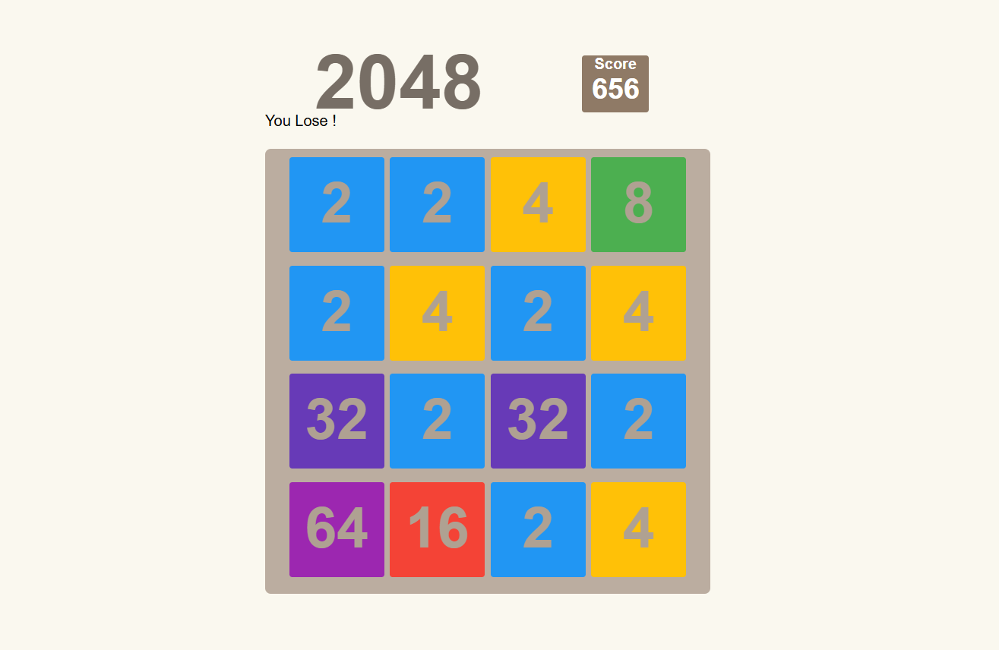

# 2048 Game

## Description
This is a simple implementation of the classic 2048 game, where players slide numbered tiles on a 4x4 grid to combine them and reach the 2048 tile.

## Features
- Classic 2048 gameplay.
- Smooth animations for tile movements.
- Responsive design for desktop and mobile.
- Score tracking.
- Restart functionality.

## How to Play
1. Use the arrow keys (Up, Down, Left, Right) to move tiles.
2. Tiles with the same number merge when they touch, forming a new tile with double the value.
3. The goal is to reach the 2048 tile.
4. The game ends when there are no valid moves left.

## Installation
### Option 1: Play Online
- Open the `index.html` file in a web browser.

### Option 2: Run Locally
1. Clone this repository:
   ```sh
   git clone https://github.com/alicode07/2048-game.git
   ```
2. Open `index.html` in your browser.

## Technologies Used
- HTML
- CSS
- JavaScript

## Screenshots

### Gameplay



## Future Improvements
- Add undo functionality.
- Implement different board sizes.
- Add multiplayer mode.
